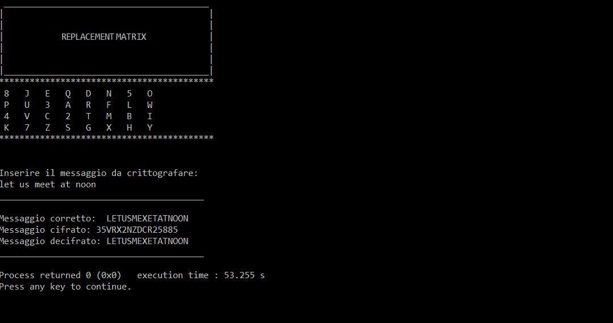
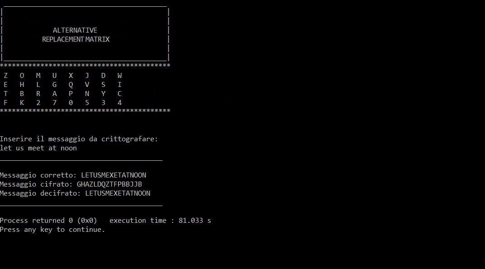

# Encryption-Decryption
Develop of a program for encrypting/decrypting a message. The algorithm is based on the so-called polyalphabetic encryption, which consists in transforming the message into a text of length greater than or equal to that of the message, called the "ciphertext", using a matrix of characters (prefixed), called "substitution matrix". The message to be encrypted is first partitioned into pairs of adjacent letters; if in such partitioning it happens that a pair is formed by the same letter, then join an X between the two.
Consider the following substitution matrix:
  

|               |               |               |               |               |               |                |               |
| ------------- |:-------------:| -------------:| -------------:|:-------------:| -------------:| -------------: |:-------------:|
|       8       |       J       |       E       |       Q       |       D       |       N       |        5       |       O       | 
|       P       |       U       |       3       |       A       |       R       |       F       |        L       |       W       |
|       4       |       V       |       C       |       2       |       T       |       M       |        B       |       I       |
|       K       |       7       |       Z       |       S       |       G       |       X       |        H       |       Y       |

 

Each pair of letters is encrypted as follows:

**a)** if the letters are in the same row of the substitution matrix, the two letters to insert in the ciphertext will be the letters immediately to the right in the same row. Each row is considered circular. For example, the pair TI is encrypted as M4.

**b)** if the letters are in the same column of the substitution matrix, the two letters to put in the ciphertext will be the letters immediately below in the same column. Each column is considered circular. For example, the RG pair is encrypted as TD.

**c)** if the letters appear in different rows and columns of the substitution matrix, each of the two letters will be encrypted with the letter in the same row but in the other letter's column. For example, the pair LE is encrypted as 35.
 
 

## Algorithm Steps

` 1. The main reads from the keyboard the message to be encrypted`

` 2. Call encryption function (return the encrypted text)`

` 3. Call the decryption function (return the decrypted text which must coincide with the starting message`
 
 

## Results

   
## Alternative Version

Alternate version of the main, where the replacement matrix is a random permutation of the previous array, using the `rand()` function, whose prototype is in `<stdlib.h>`, to generate random integers for exchanging in pairs of array elements.

 

## Results

